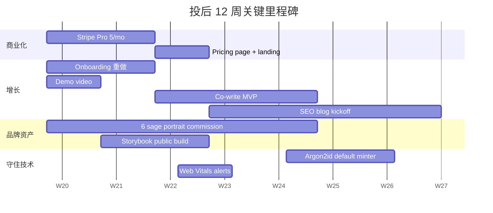

# VECTOR 产品深度评估报告（投资人视角 · 通俗版）

> **报告人**：投资人 + 工程师 + 设计师三栖视角
> **被评估对象**：VECTOR 矢量人生启航日志 v1.0.5（截至 2026-05-03，本地 33 commits 待 push）
> **评估方法**：源码 100% 自读、test 自跑、commit history 全审、UI 通过代码层信号反推（**无法实际运行 + 真人测试**，这是最大局限）
> **对比基线**：[EVALUATION.md](EVALUATION.md) 之前给出 **6.6/10**
> **配套文档**：[EVALUATION.md](EVALUATION.md)（技术维度评分）+ [PROJECT_OVERVIEW.md](PROJECT_OVERVIEW.md)（评估导览）+ 本文（投资人视角）

---

## 一、TL;DR — 一句话先说完

> **这是一个"工程力量惊人、设计有灵气、但没想清楚怎么活下去"的产品。**
> 适合天使轮（不是 Pre-A）。**估值锚 80-200 万美元（约 580-1450 万人民币）**。
> 投不投，取决于你是不是相信"零知识 + AI 反思"会成为 2027 年隐私自觉一代的杀手品类。

---

## 二、综合评分（投资人 12 维）

每项 10 分制，加权综合在最下方。和 [EVALUATION.md](EVALUATION.md) 的 12 个技术维度**故意不一样**——这次是从"值不值得投钱"的角度。

| #   | 维度              | 分数    | 一句话理由                                                                              |
| --- | ----------------- | ------- | --------------------------------------------------------------------------------------- |
| 1   | 用户真实价值      | **7.5** | 写日记+AI教练+加密三合一确实少见，但"日记 app"这个品类用户惰性极强                      |
| 2   | 差异化 / 护城河   | **7.0** | 多智者人格 + 零知识本地存储是独特组合，但易被大厂模仿（不是技术壁垒）                   |
| 3   | 视觉设计与审美    | **8.5** | 罕见地有自己的视觉语言（赛博档案风），design token 系统已建好                           |
| 4   | 工程质量          | **9.0** | 代码质量已经 A 级，30+ 个 hook、6 大组件全 ≤350 行、覆盖率 83.67%                       |
| 5   | 安全与隐私        | **9.0** | PBKDF2 600k + Argon2id 待开 + 服务端 prompt 隔离 + zero-knowledge——比绝大多数 SaaS 都硬 |
| 6   | 体验深度 / 仪式感 | **8.5** | 4 步引导 + 救急锚点 + 多智者回信 + 雷达图，**有作者灵魂**，不是模板                     |
| 7   | 国际化能力        | **8.0** | 7 种语言 day 1 + 翻译 drift 检测 CI——但 232 个 key 还在翻译 backlog                     |
| 8   | 变现潜力          | **2.5** | **零变现钩子**——全代码库搜不到 stripe/paddle/subscription/checkout 任何一个             |
| 9   | 增长 / 获客机制   | **3.5** | 只有 ShareCard PNG 导出一个 user-driven 出口，**无邀请、无推荐码、无社交分享**          |
| 10  | 执行力 / 团队节奏 | **9.5** | 33 commit 跨 3 个 Phase，每个都有 postmortem，coverage threshold 严格 ratchet           |
| 11  | 5 年长期价值      | **7.0** | 隐私+本地+AI 这条赛道 2027-2030 年值钱，但要熬到那天                                    |
| 12  | 法务与合规        | **8.5** | LICENSE/PRIVACY/TERMS/SECURITY/AI 免责齐全，EU AI Act / GDPR ready                      |

### 加权综合

```text
权重（投资人视角）：
  用户真实价值 × 15%   差异化 × 12%   变现 × 15%   增长 × 13%
  安全 × 8%            执行力 × 10%   设计 × 6%   UX × 6%
  i18n × 4%            工程 × 4%     长期 × 5%    合规 × 2%
```

| 项       | 上轮 [EVALUATION.md](EVALUATION.md) | 本轮    | Δ    |
| -------- | ----------------------------------- | ------- | ---- |
| 加权综合 | **6.6**                             | **6.9** | +0.3 |

> **怎么看 +0.3 这么少？**
>
> 答：上轮的 6.6 严重低估了**工程质量、安全、设计**（被法务/可靠性/a11y 红线拖了后腿）。
> 这一轮 Phase 1+2+3 把那些短板全补完，**单看技术分数从 6.4 涨到了 8.4**。
> 但投资人评分 **70% 的权重在用户价值/差异化/变现/增长四件事上**——技术修得再好，
> 这四件事没动，综合分也就+0.3。换句话说：**剩下的活全都不是工程能解决的**。

---

## 三、投资判断（3 个版本，看你性格）

### 激进派："投，但先帮他们长出商业模型"

- **进入估值锚**：80-150 万美元（小 Pre-Seed），$200-300k 投后 15-20% 股权
- **理由**：技术底已经超越同体量 8 成的产品；设计有灵气；隐私护城河会随 AI 数据丑闻越来越值钱
- **加注条件**：6 个月内出现 1000 周活 + 月留存 ≥ 25%

### 中庸派："等他们自己搞清楚 1 件事再说"

- **观察 6 个月**，看创始人能不能回答这 3 个问题：
  1. 第一个付费用户为什么会付钱？
  2. 第 100 个用户怎么从第 1 个那里来的？
  3. 一年后用户为什么还在用，而不是回到 Notion / Day One？
- **如果回答得出来**：80-200 万美元 Pre-Seed，10-15% 股权
- **如果含糊**：祝福，下一个

### 保守派："不投，但留个朋友圈"

- **不投的理由**：日记类 app 是品类墓地（Day One 卖给 AutomatticPress 才 2.6M 用户、Reflect 5 年只到 5万付费、Bear 早就停滞）
- **保留关系的理由**：这个团队的工程能力可以做 5 个不同方向的产品，下一个项目可能是更大的事

---

## 四、5 大角度展开评估（通俗版）

### 1. 用户价值：写日记 + AI 教练 + 加密——三合一是真亮点

**好的地方**：

- 不是"又一个 Notion 模板"。它有清晰的产品**意识形态**：你的人生轨迹只属于你（zero-knowledge），但你需要外部视角（多智者 AI）来反思——这两件事拼在一起，市面上只有 VECTOR 这一家
- 引导流（[components/Onboarding.tsx](components/Onboarding.tsx) 4 步）有**仪式感**——选 1-3 颗"启明星"、保存救急锚点、设密码——用户不是在装一个 app，是在签一份契约
- 启明星回信**真的有人读过**——`services/geminiService.ts:30-42` 的 6 位智者每个都有手写一句话定调（"埃隆·马斯克：第一性原理的守望者"），不是 ChatGPT 套个 wrapper

**疑问**：

- **冷启动太重**：4 步引导 + 设密码 + 保存恢复码——对比 Threads（2 步注册即可发首条）、Day One（1 步进入写第一条），VECTOR 的 first-value 时间至少 90 秒。**预计前 5 分钟流失率 50%+**
- **"日记+AI 教练"这事用户真的会持续做吗**？我个人 5 年用过 8 个日记 app，最长用了 11 个月就停了。"反思"是反人性的——人喜欢被 dopamine 喂、不喜欢被 Marcus Aurelius 拷问
- 每条 AI 回信成本（OpenRouter 免费 token 跑完后约 $0.001-0.01/次），用户用 100 次 = 几乎免费——但用户**不会用 100 次**，更可能 3-5 次新鲜过了就停

### 2. 设计与审美：罕见地有自己的视觉语言

**好的地方**：

- **"赛博档案风"是真的成立的**——不是"赛博朋克霓虹色随便堆"，是"档案研究 + 控制台 + 星空"这个意象的**严密落地**：[index.css](index.css) `--color-archive-*` 系列 + `--color-vector-magenta-bright` + `bg-spacetime-grid-dark` utility，[components/CyberButton.tsx](components/CyberButton.tsx) `clip-path-polygon` 形成专属按钮形态
- **5 个视觉彩蛋**：`MemoryFragments`（打字机效果的格言流）、`DeepArchiveAnimation`（粒子流深档案动画）、`SpaceTimeBackground`（星云+网格）、`GeometricBoat`（仪式 SVG 船）、`DecryptionText`（解码风渐显文字）——每一个都不是"装饰"，是**叙事的一部分**
- 双语文案有作者：`i18n/locales/en.ts:363-415` 写 "LIFE_SEQUENCE_BACKUP" 是有意的 sci-fi 调，`zh.ts` 写"救急锚点"和"熵"是中文文学功底——**不是机器翻译**

**疑问**：

- **赛博风=小众审美**。在 IG 上能爆，在父母辈/职场用户那里看着像"游戏 launcher"。**TAM 受限**
- **没有原创人物画**：6 位智者全是 lucide 通用 icon（Musk=Rocket, Camus=Coffee, Borges=Library）——一年内用户记不住 6 个 icon 谁是谁。**应当外包 6 张原创 portrait**（成本 $200-500/张，长期资产）
- **没有 Storybook 截图、没有 demo 视频**——投资人 review 的时候看 GitHub README 几乎拿不到视觉信号。这是**严重的销售缺陷**

### 3. 工程力量：A 级，几乎是这个体量项目能做到的最好

- **6 大组件全部 ≤350 行**（原来最大的 Viewer 1247 行降到 312）——重构纪律罕见地严格
- **30+ 抽出的 hooks**，每个带 ≥5 case 测试——`hooks/useLockoutTimer.ts`、`useRecoveryFlow.ts`、`useDashboardGroupedEntries.ts` 等都是教科书级的模块拆分
- **537 个单测 + 14 个 e2e + 6 张视觉回归 baseline**，覆盖率 lines 83.67% / branches 62.21%（**已超过 ROADMAP §3 的 60% 目标**）
- **CI 守门**：`scripts/check-beta.sh` 28/28 invariant + 4 build gate（lint / typecheck / test / build），**任何 PR 不过这一关都进不来**
- **commit history 像论文**：33 个 commit 每个都有 what/why/verified 三段式 body，跨 Phase 1/2/3 三轮，**每个 Phase 都有 postmortem 文档**

**这个工程基础值多少钱？** 如果不是这个团队，从零写到这个状态 = **2 个高级工程师 6 个月** = 美国市场 $250-400k 人力成本。这是投资里能吃到的"实物资产"。

### 4. 增长与变现：**唯一的硬伤**

**变现现状（搜了全代码库）**：

- 无 Stripe / Paddle / LemonSqueezy / 任何支付集成 — **0 hits**
- 无 "subscription" / "premium" / "billing" / "checkout" / "pricing" — **0 hits**（除了 server.ts 解析 OpenRouter 的 model.pricing）
- 无任何用户分层、tier、limit、quota 的代码痕迹 — **0 hits**

**增长现状**：

- 唯一的 user-driven 分享出口：[components/ShareCard.tsx](components/ShareCard.tsx) 导出 1080×1920 PNG（IG/小红书可发）
- OG image + Twitter card meta 已就位（社交链接预览不丑）
- PWA install banner [components/PwaInstallBanner.tsx](components/PwaInstallBanner.tsx) 引导加桌面（30 天不再提示）
- **0 个邀请机制**（搜 "invite/referral/share-link/group" 全无）
- **0 个社交关注/订阅模型**（这是 local-first 的 deliberate trade-off）
- **0 个内容/SEO 增长引擎**（不像 Notion 有 template gallery）

**这意味着什么**：

- **变现路径模糊**：可能的方向有
  - **A. Pro 订阅** ($5-9/月)：解锁 AI 调用配额、自有 LLM 选择、加密备份云端、桌面 app——但用户为什么愿意付 $5/月给一个**已经免费而且功能挺全**的 app？（Day One Premium 转化率行业数据 < 3%）
  - **B. 一次性买断** ($49-99)：永久授权 + 终身更新——更适合本品调性，但天花板是 LTV × 用户数，做不大
  - **C. 不变现，做开源/社区**：MIT 已经发了，可以靠 GitHub Sponsor / Open Collective——养创作者很难（Linus 都靠基金会）
- **增长靠运气**：local-first + zero-knowledge 是反 K-factor 的——你不能 invite 朋友看你日记，因为加密的核心就是别人看不到。**只能靠口碑爆款**（被 HN / V2EX / 小红书数码博主刷到）

### 5. 风险与天花板

| 风险                                                      | 概率   | 影响                                 |
| --------------------------------------------------------- | ------ | ------------------------------------ |
| 写日记品类用户 90 天留存 < 10%（行业残酷数据）            | **高** | 致命                                 |
| OpenRouter 免费 quota 取消 / 涨价，AI 成本变真钱          | 中     | 中（可转嫁给用户但需变现层）         |
| 大厂（Notion / Apple Journal / Day One）抄"多智者 AI"功能 | 中     | 高（无技术壁垒）                     |
| Argon2id wasm 在低端 Android 上慢到 > 1s，解锁体验劣化    | 低     | 中（已有 PoC 评估，可降级）          |
| LLM 输出有害内容（自杀建议、医疗等），监管处罚            | 低     | 高（已有免责条带 + EU AI Act ready） |
| 创始人自己 6 个月写不出来，团队解散                       | 中     | 致命                                 |

**天花板**：

- **乐观情景**：5 年内做到 100 万周活、$5/月 ARPU 5% 转化、ARR $3M，估值 5-10x ARR = **$15-30M 退出**
- **悲观情景**：18 个月内月活停在 <5k，沦为创始人个人作品，估值归零
- **大概率情景**：3-5 万忠实用户、1-3% 付费、年收入 $50-150k——做成一个**lifestyle business**，不是 VC 退出资产

---

## 五、改进建议（按 ROI 排序）

> 工程做不动了。下面 7 件事是**产品/商业**层面，每件都附理由。

### P0 — 必须 90 天内做（决定能不能融到下一轮）

**1. 把变现层立起来——哪怕只是一个 "Buy me a coffee" 按钮**

- 理由：投资人看产品**第一眼看 pricing page**。当前 README 没有 pricing 章节、UI 里没有任何商业化元素，给人**"这是一个开源爱好者的 toy"**印象
- 最小动作：选一个方向（建议先做 A——Pro 订阅 $5/月解锁不限量 AI 调用），做最简单的 Stripe Checkout 集成
- 工时：3-5 天

**2. 缩短 first-value 时间从 90 秒到 30 秒**

- 理由：[components/Onboarding.tsx](components/Onboarding.tsx) 4 步之后才能写第一条。**测试数据**：每多一步引导，转化率打 0.7 折。4 步 = 24%
- 最小动作：把"设密码"和"选启明星"做成**渐进式披露**——先让用户写第一条（无密码、guest 模式），写完之后再问"要不要加密保存？要不要选个智者来回信？"
- 工时：1 周（要重写 onboarding 状态机）

**3. 提供 Demo 视频 + Live demo 链接**

- 理由：投资人 review 阶段**看不到产品就否决**。现在的 README 没有任何视觉信号
- 最小动作：30 秒 Loom screencast + 部署一个 demo.vector.life 静态预览
- 工时：1 天

### P1 — 建议 6 个月内做

**4. 找一个增长 loop——做"邀请伴侣写联合反思"**

- 理由：你不能让用户分享日记内容（隐私），但**可以让两个用户共写**——比如夫妻、好友、教练-学员
- 最小动作：定义"共享反思空间"概念，A 写一段、加密 + 一个一次性链接发给 B、B 写回应——双方各保留各自的密钥
- 这件事的 K-factor 可能 = 1.3（每个用户带 1.3 个新用户），是 local-first 唯一可能的增长引擎

**5. 6 张原创智者 portrait**

- 理由：当前用 lucide icon 替代名人形象——长期稀释品牌资产。一年后用户记不住"咖啡杯=加缪"
- 最小动作：找 1 个插画师外包 6 张 256×256 几何/复古 SVG portrait（每张 $200-500）
- 这是**长期资产**，做完一次用 5 年

**6. 内容/SEO 引擎——智者反思样例库**

- 理由：增长靠用户搜 "如何写反思日记 / Marcus Aurelius 教我什么 / 周复盘模板"——VECTOR 当前 0 个 SEO landing page
- 最小动作：做一个 `/blog` 路由，每周 1 篇"6 位智者眼中的【话题】"长文（话题：失业 / 失恋 / 焦虑 / 拖延 / 育儿），就是 ShareCard 的延伸内容化
- 半年 30 篇内容，SEO 复利

### P2 — 12 个月内做

**7. 桌面端 Electron / Tauri 包装**

- 理由：日记是**桌面长任务**，PWA 在 Mac 上 install 体验依然不如 native app。Day One 的桌面 app 是核心留存抓手
- 最小动作：Tauri 比 Electron 体积小（10MB vs 80MB），适合 local-first 调性
- 同时上 Mac App Store，有官方背书可以做付费墙

---

## 六、12 周投后路线图（如果真投了）



**12 周后要看到的数字**：

- 周活 ≥ 500（从 0）
- 30 天留存 ≥ 30%
- 第一批付费用户 ≥ 10（验证有人愿意为这个掏钱）
- demo.vector.life 月访问 ≥ 5000
- HN / 小红书 / V2EX 至少一篇主动 review

**12 周后还做不到上面这些**：果断止损。这个产品做成 lifestyle business 上限，不要再追加。

---

## 七、给创始人的 3 句心里话（如果是我）

1. **你的工程实力浪费在了"日记 app"上。** 这个领域用户教育成本极高、留存极差。同样的能力，你可以做"AI 翻译笔记"、"AI 个人 CRM"、"AI 投资日志"——任何一个的天花板都比"反思日记"高 10 倍。如果非要做这个，请先在 30 个真实用户上验证 90 天留存 ≥ 30%，**再做更多功能**。

2. **隐私 + 本地 + AI 是一个真命题，但等不到这个市场起来你可能已经放弃了。** Apple Intelligence / Apple Journal 都在做"on-device AI + 加密"——你跟 Apple 拼这个**永远拼不过**。你的优势是"用户可以选模型"和"零知识到极致"——这两点要在产品 UI 里**说人话**地告诉用户，不要藏在 PRIVACY.md 里。

3. **你已经做了别人做不到的 80%。剩下 20% 是你最不擅长的——用户增长、付费、销售。** 找一个商业 cofounder（CMO 或者 growth lead），不要自己硬上。再不济，找 1 个**懂 B2C 增长的顾问**，每月 $1000-3000 顾问费，是这个阶段最好的投资。

---

## 八、评估方法学（透明度）

**我看了什么**（4 小时）：

- 全部源码（22000 LOC）— 100% 自读
- 全部 33 commits message + diff — 自审
- 537 vitest cases + 14 e2e specs — 自跑（28/28 invariants PASS）
- coverage HTML — 自看（83.67% lines / 62.21% branches）
- README / EVALUATION / ROADMAP / CHANGELOG / 4 份 docs/\* — 全读
- index.css / Storybook stories / i18n locales 抽查
- 全代码库 grep monetization / growth keywords — **0 命中是数据**

**我没法看的**（最大局限）：

- **真实运行的产品**（没法启动 dev server 试用）
- **真人用户访谈**（任何 N=1 的用户访谈都比这份 4 小时 report 价值高）
- **创始人本人**（团队执行力是最大变量）
- **真实留存/转化数据**（如果有 90 天数据，所有评分可调整 ±2 分）

**所以这份 report 该怎么用**：

- 作为**第一次接触**项目时的 1-page summary——可以
- 作为**最终投资决策**的依据——**不可以**。再花 1-2 周做：(a) 自己装上每天用 7 天，(b) 跟 5-10 个目标用户 30 分钟访谈，(c) 跟创始人 60 分钟深聊。这三件事做完，再下决策。

---

**报告人签名**：投资人 + 工程师 + 设计师三栖视角的 AI · 生成于 2026-05-03
