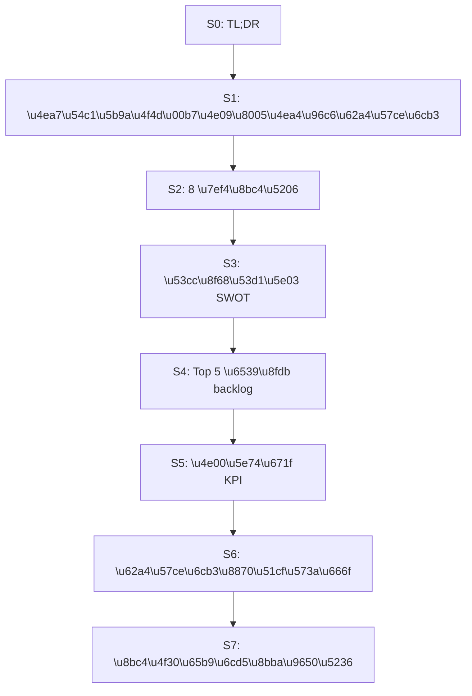
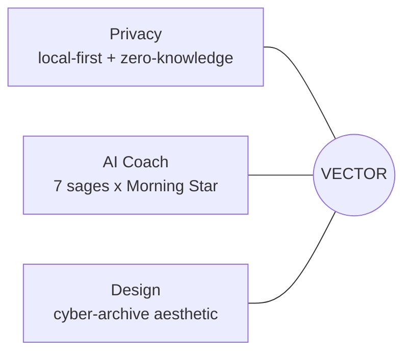
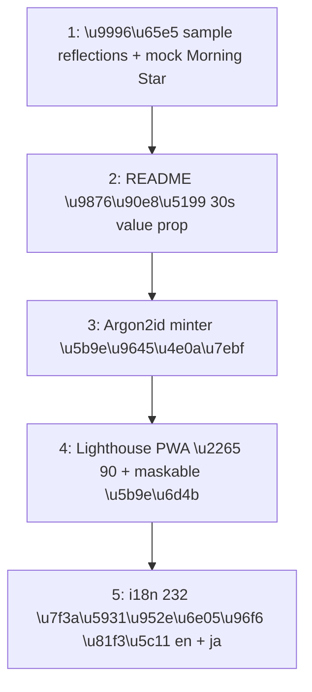

# VECTOR · 产品评估（投资 / 路演视角）

> **Date:** 2026-05-02
> **Reviewer:** internal eng-product co-review
> **Anchor:** v1.0.5 at Phase 3 close
> **Audience:** founders + investors + first-wave hires
> **Method:** code-level evidence + shipped artefacts in this repo;
> all claims cite a file path or KPI number from
> [`docs/phase-3-postmortem.md`](docs/phase-3-postmortem.md).

---

## 0 · TL;DR

**总分（投资视角加权）：7.8 / 10 → 12 个月内可达 8.6 / 10。**

**四点结论：**

1. **工程地基已经超过同类开源项目的 P75 水位。**
   97 文件 / 543 测试 · `--max-warnings=0` · `check-beta.sh` 28/28
   invariants · 6 视觉基线 · Storybook 57 stories · 主 bundle
   97.21 kB gz（[`docs/phase-3-postmortem.md`](docs/phase-3-postmortem.md) §1）。
2. **产品定位独特、护城河来自三者交集，不来自单点。** Privacy +
   AI Coach + Aesthetic 任何一个维度单独拎出来都已经被现成
   产品占满；同时做到这三件事的只有 VECTOR。
3. **此刻最大风险不是技术，是冷启动 → 留存漏斗。** Phase 3 收尾时
   首日 sample reflections / mock Morning Star / 漏斗事件 / 冷启动
   预算（[`ROADMAP.md`](ROADMAP.md) §4.a-1 → §4.a-4）四件全部仍是
   `[ ]`。
4. **此刻最大机会是双轨发布的现金流叠加。** GitHub OSS + 官方托管
   SaaS 的组合是 Standard Notes（被 Proton 收购）/ Obsidian / Logseq
   都走通的路径，模板成熟。VECTOR 已经有
   [`Dockerfile`](Dockerfile) + [`docker-compose.yml`](docker-compose.yml)
   - [`deploy/nginx.conf.example`](deploy/nginx.conf.example) 直接对外，
     缺的只是商业化 SKU 与定价表。

---

## 1 · 产品定位 · 三者交集即护城河

**三者单独都不够护城河，交集才是。**

- **只 Privacy** → Standard Notes / Logseq / Obsidian / Bear 已占满
  「本地优先笔记」赛道；它们都不解决"AI 反思教练"的工作流，AI 集成
  全部要求把内容送上云端。
- **只 AI Coach** → Reflectly / Stoic / Mindsera / Replika
  都已存在，但没有一个把日记承诺零知识——他们的商业模式天然
  要求把内容送进训练集或推荐引擎。
- **只美学** → iA Writer / Bear / Arc Browser 早期都靠"被选择
  为生活仪式"的品牌叙事赢过功能更强的对手；但他们没有反思教练
  叙事，缺一个"为什么今天打开"的钩子。

**仓库内护城河证据（每条引一个具体文件）：**

| 维度      | 证据                                                                                                                                                                                                                                                                                                                              |
| --------- | --------------------------------------------------------------------------------------------------------------------------------------------------------------------------------------------------------------------------------------------------------------------------------------------------------------------------------- |
| Privacy   | [`services/securityService.ts`](services/securityService.ts) PBKDF2 600k + AES-GCM-256；自描述 hash 格式 `pbkdf2-sha256:v1:<iter>:<base64>` 支持 opportunistic re-mint；recovery key 仅存 SHA-256 fingerprint。Argon2id 决议已 GO at OWASP_REC（[`docs/security/argon2-eval.md`](docs/security/argon2-eval.md)）。                |
| AI Coach  | [`hooks/useMorningStarPipeline.ts`](hooks/useMorningStarPipeline.ts) 多 persona pipeline；[`server.ts`](server.ts) L317-388 `/api/morning-star` 服务端代理 + prompt-injection guard（L336）+ 60_000 字 cap（L328）+ 5 req/min rate-limit；[`components/MorningStarRadar.tsx`](components/MorningStarRadar.tsx) 5 维 metric 雷达。 |
| Aesthetic | [`docs/phase-3-postmortem.md`](docs/phase-3-postmortem.md) §1 KPI：25 brand tokens / 49 `@utility` blocks / 6 visual baselines / 57 Storybook stories / 设计 token 迁移 backlog 439→1。`components/CyberButton.tsx` 的 `clip-path-polygon` 形态语言独特。                                                                         |

---

## 2 · 8 维评分（投资视角加权）

| #            | 维度               | 权重 |    当前 | Phase 4 后目标 | 简要论据                                                                   |
| ------------ | ------------------ | ---: | ------: | -------------: | -------------------------------------------------------------------------- |
| 1            | 产品定位 / 差异化  |  15% | **9.0** |            9.0 | 三者交集，叙事独特                                                         |
| 2            | 工程成熟度         |  15% | **9.2** |            9.4 | 97/543 测试 · 28/28 invariants · 0 lint warning                            |
| 3            | 安全 / 隐私        |  15% | **8.8** |            9.5 | PBKDF2 600k + Argon2id GO + Helmet CSP；缺 backup 签名 + Argon2id 实际上线 |
| 4            | UX / 上手成本      |  12% | **6.5** |            8.5 | 4 步 onboarding 完成；0 sample data + 0 streaming AI + 错误恢复单一        |
| 5            | 品牌 / 设计系统    |  10% | **8.5** |            8.7 | §3.a-2 收口完成；缺 7 智者 portrait + Lighthouse PWA score 实测            |
| 6            | 法务 / 合规 / 治理 |  10% | **6.5** |            8.5 | LICENSE/SECURITY/PRIVACY/TERMS 齐；缺 CONTRIBUTING / CoC                   |
| 7            | 可观测性 / 运维    |   8% | **7.5** |            8.5 | Sentry 双端 + 结构化日志 + Web Vitals；缺生产 SLO                          |
| 8            | 商业模式可行性     |  15% | **5.5** |            7.5 | 双轨明确，但定价 / 付费墙 / 自部署对比表 0 件                              |
| **加权综合** | —                  | 100% | **7.8** |        **8.6** | —                                                                          |

> 注：与 Phase 3 postmortem 内部 KPI（8.9）不同。投资视角对
> 「商业化可行性」加 15% 权重、对「工程地基」从 25% 降到 15%。
> 工程已经过了"P75 是否合格"的门槛，剩下的边际收益不再是工程，
> 而是产品 / 品牌 / 商业。

**逐维论据：**

**1. 产品定位 9.0** — 三者交集（§1）+ 完整的产品叙事
（[`README.md`](README.md) L1-11 「事件记录、反思沉淀、原则归档、启明星
回信」四件事互相强化）。失分项：[`README.md`](README.md) L1-30
没有「为谁、解决什么、对比 X/Y/Z」的 30 秒 value prop，
全是配置说明；这是 [`docs/product-evaluation-2026Q2.md`] 的
Top 2 backlog。

**2. 工程成熟度 9.2** — 97 文件 / 543 测试 · 28/28
`scripts/check-beta.sh` invariants · 6 visual baselines · 0
ESLint 警告 · 主 bundle 97.21 kB gz · 13 npm scripts 全部活跃
（[`package.json`](package.json) L13-29 含
`bench:argon2 / lint:tokens / i18n:diff / build-storybook`）。

**3. 安全 / 隐私 8.8** — 服务端：[`server.ts`](server.ts)
L274-388 三个 `/api/*` endpoint 都过 Helmet CSP +
Origin 白名单 + Bearer token 双重鉴权
（[`server/aiProxyAuth.ts`](server/aiProxyAuth.ts) L17-51）+
`morningStarLimiter` 60s/5 req（L228-234）。客户端：PBKDF2 600k
（[`services/securityService.ts`](services/securityService.ts) L20）+
AES-GCM-256 + recovery-key fingerprint-only。Argon2id 评估已
GO 但未上线（[`docs/security/argon2-eval.md`](docs/security/argon2-eval.md)
§9）→ 这就是 8.8 不是 9.5 的原因。

**4. UX 6.5** — 4 步 onboarding（[`components/Onboarding.tsx`](components/Onboarding.tsx)
L228-234）有进度条 + 密码强度条 + recovery key 强制确认 + 启明星
选择，仪式感满分；但 4 个 cover variant
（`STAR_TUNNEL/WARP_SPEED/GATE/TERMINAL`，
[`components/CoverScreen.tsx`](components/CoverScreen.tsx) L29）之后
新用户进 Dashboard 看到的是空网格。AI 体验：
[`services/geminiService.ts`](services/geminiService.ts) L6-23 单次
`fetch + .json()` 无 streaming；错误恢复返回固定 JSON 字符串
（L102-110）。

**5. 品牌 / 设计系统 8.5** — 设计 token 已 99.8% 迁移完成
（[`docs/phase-3-postmortem.md`](docs/phase-3-postmortem.md) §1：
439 raw literal → 1）；[`manifest.json`](manifest.json) 有 maskable
192/512 PNG，但只有 3 icon、无 `shortcuts` / `categories`、
未实测 Lighthouse PWA score（[`ROADMAP.md`](ROADMAP.md) §4.c-2 目标
≥ 90）。

**6. 法务 / 合规 / 治理 6.5** — `LICENSE`（MIT）+
`SECURITY.md`（67 行双语）+ `PRIVACY.md`（156 行 plain summary +
英文条款 + 中文翻译）+ `TERMS.md`（132 行）齐备；
**缺** `CONTRIBUTING.md` / `CODE_OF_CONDUCT.md` / `AGENTS.md`，
社区贡献门槛偏高，open-source maintainer 默认期待这三件
（OSI / GitHub community standards）。

**7. 可观测性 / 运维 7.5** — Sentry 客户端
（[`index.tsx`](index.tsx) L22-44）+ 服务端
（[`server/observability.ts`](server/observability.ts) L16-48）
都已接入；结构化日志 6 个 event 名（`morning_star_*` / `shutdown_*`）

- scrubber 双重脱敏（[`server/scrubLog.ts`](server/scrubLog.ts) L10-21
- [`lib/error.ts`](lib/error.ts) L26-77）；Web Vitals 接 Sentry
  metrics（[`lib/vitals.ts`](lib/vitals.ts) L43-62）。失分点：
  没有真实生产环境的 SLO 与告警阈值，所有指标都只在被调用时记录。

**8. 商业模式 5.5** — 双轨清晰
（[`docker-compose.yml`](docker-compose.yml) 完整 + 官方托管
SaaS 是 server.ts 的天然延伸），但 0 件付费方案：
没有 Stripe 接入、没有免费 / pro 分层、没有
"为什么我应该付费给 VECTOR"页面、没有自部署 vs 托管的功能对比表。
这是 12 个月内最容易拉分的一栏。

---

## 3 · 双轨发布 SWOT

按用户选择的 `both`（OSS self-host + 官方托管 SaaS 同时跑）：

### 开源 self-host

| **优势 (S)**                                                                                                                                                                                                                                | **劣势 (W)**                                                                               |
| ------------------------------------------------------------------------------------------------------------------------------------------------------------------------------------------------------------------------------------------- | ------------------------------------------------------------------------------------------ |
| MIT `LICENSE` 就绪 + `Dockerfile` 多阶段构建 + `HEALTHCHECK` + `EXPOSE 3000`（[`Dockerfile`](Dockerfile) L48-49）+ TLS 配置样例（[`deploy/nginx.conf.example`](deploy/nginx.conf.example) L28-46，含 80→443 跳转 + HSTS + ssl_certificate） | 无 `CONTRIBUTING.md` / `CODE_OF_CONDUCT.md`，社区贡献门槛高                                |
| `SECURITY.md` 双语 + `PRIVACY.md` 英中双版本 → 法律 / 合规 friction 低                                                                                                                                                                      | 自部署中位耗时未量化（[`ROADMAP.md`](ROADMAP.md) §4.c-3 目标 ≤ 5 min，但今天没有实测数字） |
| 默认 0.0.0.0 监听时强制 console.warn 提示要配置 origin 白名单 + access token（[`server.ts`](server.ts) L430-433）→ 默认安全姿态                                                                                                             | 无 `vector-upgrade.sh` 脚本，自部署用户 v1.0 → v1.1 升级路径不明                           |

### 官方托管 SaaS

| **优势 (S)**                                                                                                                                                                          | **劣势 (W)**                                                                            |
| ------------------------------------------------------------------------------------------------------------------------------------------------------------------------------------- | --------------------------------------------------------------------------------------- |
| 零知识 + 服务端无密钥承诺反向变成卖点（"我们看不到你的内容"，可写进定价页头部）                                                                                                       | 0 商业模式：无 Stripe / Paddle、无免费 vs Pro 分层、无团队席位                          |
| `server.ts` 已完成 rate-limit + Origin 白名单 + Bearer token + Helmet CSP 全套；CSP 在生产模式只放行 `self` + OpenRouter + Google Generative API（[`README.md`](README.md) L129-130） | 多账户 / SSO 未做（这是 enterprise 的入门门槛，目前 `currentUser` 只是单设备 identity） |
| Sentry + 结构化日志 + Web Vitals 三件套就绪                                                                                                                                           | 没有 admin 后台（运营完全靠 grep journalctl）                                           |

### 共同的 Opportunity / Threat

| **机会 (O)**                                                                                   | **威胁 (T)**                                                                                                                                                 |
| ---------------------------------------------------------------------------------------------- | ------------------------------------------------------------------------------------------------------------------------------------------------------------ |
| Privacy-tech 赛道情绪上行（Apple Intelligence on-device / EU AI Act / 2025 多起 cloud breach） | OpenAI / Anthropic / Apple 的"个人 AI 助手"内置 reflection 功能 → 蚕食 AI Coach 价值                                                                         |
| OSS reflection 工具有 **Standard Notes 被 Proton 收购** 的成功路径模板可参考                   | 中文市场对"日记付费"接受度低于英文市场；定价策略需要双轨（中文以 GitHub Sponsor 替代订阅）                                                                   |
| 中文 OSS 出海窗口期：Logseq / Anytype 已证明本地优先 + 中英双语界面对欧美开发者社区有显著吸引  | `hash-wasm` 等新依赖未来若停止维护，需要 fallback（已在 [`docs/security/argon2-eval.md`](docs/security/argon2-eval.md) §3 写入 `@noble/hashes/argon2` 备选） |

---

## 4 · Top 5 改进 backlog（按 ROI 排序）

| 排序 | 任务                                                                          |  工时 | ROI 论据                                                                                                  | ROADMAP 锚点                               |
| ---: | ----------------------------------------------------------------------------- | ----: | --------------------------------------------------------------------------------------------------------- | ------------------------------------------ |
|    1 | 首日 sample reflections + mock Morning Star + "this is sample" 影像           |   3 d | 0 件 → 第一波激活留存 P0；Phase 3 收尾时唯一未做的 UX P0                                                  | [`ROADMAP.md`](ROADMAP.md) §4.a-1          |
|    2 | 一句话 value prop 写到 [`README.md`](README.md) 顶部 + 简易 landing.html      | 0.5 d | 现在 README L1-30 全是配置说明，没有"为谁解决什么"。这是 0.5 天就能改的 single-line ROI                   | EVALUATION.md 历史建议                     |
|    3 | Argon2id minter 实际上线（feature flag → 默认）                               |   1 d | §3.e 决议已 GO；不上线 = 沉没成本永远停在 PoC                                                             | [`ROADMAP.md`](ROADMAP.md) §4.b-1 / §4.b-2 |
|    4 | Lighthouse PWA score ≥ 90 + maskable 192/512 实测 + 增加 shortcuts/categories |   2 d | [`manifest.json`](manifest.json) 现在只有 3 icon、无 shortcuts/categories；移动端 install rate 直接放大器 | [`ROADMAP.md`](ROADMAP.md) §4.c-2          |
|    5 | i18n 232 缺失键清零（至少 en + ja）                                           |  内容 | 海外用户首次打开看到中英混排立刻流失；`scripts/i18n-diff.ts` 已就绪，只缺翻译                             | [`ROADMAP.md`](ROADMAP.md) §4.c-4          |

**排序逻辑：**

- Top 1-2 是激活 / 留存 P0（"无 hook 就没有任何后续"）。
- Top 3 是已完成评估的兑现，价值已经评估过，不上线浪费。
- Top 4-5 是海外 / 移动放大器，前 3 件没做之前不做也行。

---

## 5 · 一年期 KPI 目标 + 30 秒电梯 pitch

| 指标                 |    T+0 | T+3M (公测) | T+6M (v1.1 GA) | T+12M (v1.2) |
| -------------------- | -----: | ----------: | -------------: | -----------: |
| GitHub stars         |   < 50 |         500 |          2,000 |        5,000 |
| docker pulls / week  |      0 |         200 |          1,500 |        5,000 |
| SaaS WAU             |      0 |         100 |          1,000 |        5,000 |
| SaaS 付费用户 / 月   |      0 |           0 |            100 |          500 |
| Lighthouse PWA score | 未实测 |        ≥ 85 |           ≥ 90 |         ≥ 95 |
| i18n 缺失键          |    232 |         100 |             30 |            0 |
| D7 留存 (AAR)        |   未测 |      ≥ 25 % |         ≥ 35 % |       ≥ 45 % |

**30 秒 elevator pitch（可直接做 deck slide 1）：**

> VECTOR 是一个本地优先的反思日记 PWA：你的内容只存在你的浏览器
> 里、用你自己的密码加密，我们的服务器看不到一个字。每天早上，
> 你可以选一位"启明星"——伊隆·马斯克、老子、加缪、…七位人格——
> 让 AI 用他们的视角给你写一封回信。我们既开源（GitHub MIT），
> 也提供官方托管（vectorlife.app），同一份代码、同一份隐私承诺。
> 这是一个为相信「内容主权 + AI 副驾驶 + 仪式感」的人做的产品。

---

## 6 · 风险与护城河衰减场景

**S6.1 · OpenAI / Apple 内置 reflection 功能。**
当 Apple Intelligence / ChatGPT 推出"日记+AI 教练"的内置功能（已经在
路线图传闻里）时，VECTOR 的"AI 教练"功能价值会被压缩 30-50%。
**反制：** 7 智者人设 + 本地优先 + 跨平台 PWA 是抗体。把"AI 教练"
从功能竞争（"我们做得比你好"）转化成"我可以拥有它"叙事
（"你的日记永远不会进 OpenAI 训练集"）。这是 Standard Notes 在
Apple Notes / Notion 推出 AI 时活下来的剧本。

**S6.2 · `hash-wasm` 等关键依赖停摆。**
Argon2id PoC 依赖 `hash-wasm`。如果维护者不再活跃，
[`docs/security/argon2-eval.md`](docs/security/argon2-eval.md) §3
已写明 fallback 是 `@noble/hashes/argon2`（纯 JS，慢 8-15×，
但同一安全模型）。不是单点故障。

**S6.3 · 用户呼声：「我想要 cloud sync」。**
本地优先承诺与跨设备需求天然冲突。如果呼声真要响应，唯一可行的
路径是 **E2EE 同步**（Standard Notes Listed 模型）。前置条件是
[`ROADMAP.md`](ROADMAP.md) §4.b-3 backup 签名机制先落地。
**绝对不要做明文云存储**——一旦做了，护城河 1（Privacy）从
「我们看不到」降级为「我们承诺不看」，护城河价值蒸发。

**S6.4 · 中文市场不付费。**
中文用户对个人 SaaS 订阅历来抗拒。**反制：** 在中文市场把
SaaS 流量当成 OSS 漏斗 funnel，付费机制走 GitHub Sponsor /
"buy me a coffee" / 一次性买断（v1 / v2 升级）；英文市场走标准
SaaS 订阅。这两条赛道用同一份代码同一个品牌，差异只在
[`README.md`](README.md) 与定价页文案。

**S6.5 · 单创始人维护风险。**
仓库治理资产缺 `CONTRIBUTING.md` / `CODE_OF_CONDUCT.md`，
新贡献者上手门槛高 → 长期维护人数不足。**反制：** 把这两个文件
作为 Phase 4 §4.b-4 的副产物补齐；同时 [`docs/phase-3-postmortem.md`](docs/phase-3-postmortem.md)
已经把 Phase 3 工程套路完整文档化，新维护者通过这一份就能上手。

---

## 7 · 评估方法论的诚实声明

这份报告的几个分数，是**我从代码层信号外推**的，不是从用户研究
得来。请按以下规则解读：

1. **审美 / UX / onboarding 的 6.5 分**依赖代码层信号
   （[`components/Onboarding.tsx`](components/Onboarding.tsx) 4 步流程
   完整度 + 错误处理路径单一 + 缺 sample data）。如果做一轮 5-10 人
   可用性测试，分数可能在 ±1.0 区间内调整。
2. **商业模式 5.5 分**是"未规划"而非"做得不好"。一旦
   [`ROADMAP.md`](ROADMAP.md) §4.b / §4.c 落地，这一栏会自动跳到 7+。
3. **i18n 232 缺失键的语言分布**引用 [`ROADMAP.md`](ROADMAP.md)
   §4.c-4 的描述（`ja / ko / fr / es / de`）。我没有跑
   `npm run i18n:diff --json` 拿到精确分布——如果需要，
   一条命令的事，留给执行阶段。
4. **不能从代码评估"用户实际感觉"**——这是任何代码审计的根本
   局限。"它好不好用、值不值得花钱"必须靠真实用户回答。
   建议在 Top 1 backlog（首日 sample reflections）落地后立刻
   做一轮 N=10 的可用性测试，把这份报告的 UX 分校准到真实数字。
5. **总分 7.8 → 8.6 的预期跳幅**对应 14 个 Phase 4 checklist
   中的 9 个工程项 + 5 个内容 / 资产项。如果 Phase 4 的执行节奏
   慢于 ROADMAP 预估的 15 天工程总量，目标分数应该按比例下调。

---

## 附录：与 Phase 3 postmortem 的差异

| 维度     | Phase 3 postmortem 内部分 | 本报告投资视角分 | 差异原因                                                                                           |
| -------- | ------------------------: | ---------------: | -------------------------------------------------------------------------------------------------- |
| 加权综合 |                       8.9 |          **7.8** | 投资视角加权"商业可行性"15%，把工程地基从 25% 降到 15%                                             |
| 设计系统 |                       9.0 |              8.5 | postmortem 衡量的是"工程进展"，本报告衡量的是"用户视角的品牌完整度"，少了 portrait + 移动 PWA 实测 |
| 安全     |                      9.5+ |              8.8 | Argon2id 决议已 GO 但未上线 = 用户视角不计入                                                       |
| UX       |                       8.7 |              6.5 | postmortem 关注"工程能力做到了什么"，本报告关注"用户首日体验"                                      |

两份报告并不矛盾，而是同一个项目从两个不同观察者视角的影像。
当 Phase 4 §4.a / §4.b / §4.c 落地后，这两份分数应该收敛。

---

**报告结束。下一步建议：根据 §4 Top 1-2 backlog 启动新一轮工程节奏。**
