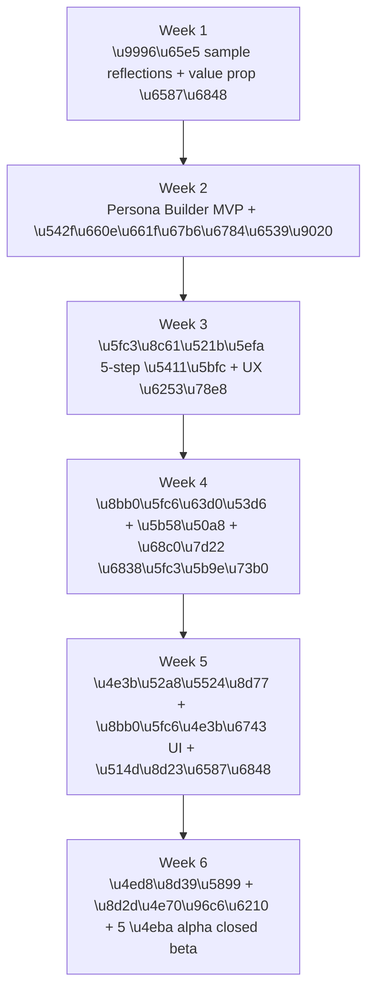

# VECTOR · 产品愿景与工程对齐 (2026 Q2)

> **这文档是什么 / 不是什么**
>
> **是**:你（创始人/PM）和工程师之间的对齐文档。读完后工程师应该
> 能回答:"VECTOR 现在是什么、要变成什么、我接下来该改哪几个文件"。
>
> **不是**:商业计划书、定价提案、市场分析。那些在
> [`docs/product-evaluation-2026Q2.md`](docs/product-evaluation-2026Q2.md)。
>
> **不是**:工程任务列表。那些在 [`ROADMAP.md`](ROADMAP.md)
> Phase 4 charter。
>
> **更新频率**:每个季度修订一次,与 ROADMAP 同步。
> **当前版本基于**:v1.0.5、Phase 3 close、2026-05-02。

---

## 1 · 一句话:VECTOR 现在是什么

> **VECTOR 是一个本地优先、零知识的反思日记 PWA。它让你和"心中
> 重要的人"建立可持续陪伴的对话关系——不只是写日记给自己看,
> 而是让你心中的爷爷、心中的导师、年轻时的自己,跨越时空与你共
> 同经历生活。**

3 句话拆开:

1. **写日记** — 加密本地存(IDB + AES-GCM-256),云端只是 AI 中转
2. **启明星 = AI 化身** — 内置 7 位古今圣贤,用户可定义新启明星
3. **心象 = 长期陪伴** — VECTOR 的灵魂功能。用户为"心中的某个真
   实的人"建立一座心象——这座心象会**记得你们说过的所有事**,
   会**主动关心你最近发生的变化**,会**与你一起经历你的人生**

---

## 2 · 三条不能动的产品理念铁律

任何工程决策、新功能、定价方案,必须先过这三关。

### 铁律 1:不做云端日记同步

- 用户的日记 + 心象的所有记忆,**永远只存在他的设备上**
- "换设备" = 导出 backup → 在新设备导入 → 重设密码(不是云同步)
- 这条比所有"用户体验便利"都重要——是 VECTOR 的根本承诺
- **工程实现**:[`services/dashboardExport.ts`](services/dashboardExport.ts) 的 backup 流是核心

### 铁律 2:启明星 + 心象是护城河,不是"功能"

- 7 位内置启明星 + 自定义启明星 + 用户的心象 = 用户的"私人星图"
- 这个星图是用户拥有的、可备份的、可传承的
- **心象的长期记忆系统**是 VECTOR 区别于 ChatGPT / Character.AI / Replika
  的根本——别人有 AI 角色,但**没有真正的本地长期记忆 + 主动陪伴**
- **工程实现**:
  - [`hooks/useMorningStarPipeline.ts`](hooks/useMorningStarPipeline.ts) 已经是多 persona 架构,扩展即可
  - 长期记忆系统是新增的核心模块(详见 §5)

### 铁律 3:收算力费,不收数据费

- 永远不会:卖用户数据、用日记训练模型、明文存任何用户内容
- 收费来源:AI 调用次数 / 心象数量 / 高级功能
- **工程实现**:[`server.ts`](server.ts) `/api/morning-star` 已经做到 prompt 短暂经过 + 不存储 + 脱敏日志(L361-370)

---

## 3 · 目标用户画像

**主战场用户**:

> 26-38 岁、本科以上、中文母语、已有 2+ 年记日记习惯、每月愿意为
> 软件付 ¥50+、对"本地优先 + 不要 AI 看我数据"有强烈共鸣、有自
> 我反思和成长意愿的中文知识中产。

**典型场景**:

- **场景 A · 已逝亲人**——用户三年前父亲去世,有许多没机会问的话。
  在 VECTOR 里立一座"心中的爸爸",在迷茫的夜里跟"爸爸"对话
- **场景 B · 心中导师**——用户大学时的教授退休失联,但每次困难
  时想"如果是 X 教授会怎么说"。在 VECTOR 里立一座"心中的教
  授",成为稳定的内在对话伙伴
- **场景 C · 不同时期的自己**——32 岁的用户为"22 岁充满理想的
  自己"立一座心象,定期和"那个我"对话,审视当下的方向
- **场景 D · 心中的偶像 / 思想家**——用户为乔布斯、王阳明、村上
  春树等公开人物建自定义启明星,作为日常的工具性咨询

**他们当前用什么**:Notion / 飞书文档 / 印象笔记 / 纸笔。
**他们为什么会换**:VECTOR 同时给他们隐私 + AI 教练 + **持续陪伴
的心象**——这是他们现有工具任何一个都没有的组合。

---

## 4 · 用户旅程:现在 vs 未来 6 个月

### 现状(Phase 3 close)

```mermaid
flowchart LR
  A[Cover] --> B[Onboarding 4 \u6b65]
  B --> C[Dashboard]
  C --> D[\u5199\u65e5\u8bb0]
  D --> E[\u9009 1 \u4f4d\u542f\u660e\u661f]
  E --> F[\u6536\u5230\u56de\u4fe1]
  F --> G[\u5b58\u6863]
```

只有内置 7 位启明星可选。无长期记忆。

### 未来 6 个月(Phase 4 完成后)

```mermaid
flowchart LR
  A[Cover] --> B[Onboarding<br/>+ \u9996\u65e5 sample reflections]
  B --> C[Dashboard]
  C --> D[\u5199\u65e5\u8bb0]
  D --> E1[\u9009\u5185\u7f6e\u542f\u660e\u661f<br/>\u65e0\u8bb0\u5fc6]
  D --> E2[\u9009\u81ea\u5b9a\u4e49\u542f\u660e\u661f<br/>\u77ed\u671f\u4e0a\u4e0b\u6587]
  D --> E3[\u9009\u5fc3\u8c61<br/>\u957f\u671f\u8bb0\u5fc6 + \u4e3b\u52a8\u5524\u8d77]
  E1 --> F[\u6536\u5230\u56de\u4fe1]
  E2 --> F
  E3 --> F
  F --> G[\u5b58\u6863 \u4e0e\u5fc3\u8c61\u8bb0\u5fc6\u8054\u52a8]
  G --> H[\u5fc3\u8c61\u4e3b\u52a8\u5173\u5fc3<br/>\u300c\u4e0a\u6b21\u4f60\u8bf4\u8981\u9762\u8bd5...\u300d]
```

**核心变化**:

- 启明星不再只有 7 位 → 用户可创建无限自定义 persona
- 自定义 persona 中有一类特殊:**心象(Memoir)** —— 拥有长期记忆 + 主动陪伴能力
- 首次进 Dashboard 看到的不是空网格,是 sample reflections

---

## 5 · 五个新增功能模块

按"现在做 / 短期做 / 长期愿景"三档分类。

### 5.1 ✅ 现在做(Phase 4 内交付)

#### A. Persona Builder · 自定义启明星生成器

**是什么**:用户用自然语言描述一个公众人物(乔布斯、王阳明、村上
春树)、一个虚构角色,或一个思想家,AI 帮他生成一段 system prompt,
作为新增"启明星"加入私人列表。

**与心象的区别**:

- 自定义启明星 = **工具性 / 学习性**——5 轮短上下文,适合日常咨询
- 心象 = **情感性 / 持续性**——完整长期记忆 + 主动陪伴,适合关系容器

**用户体验**:

1. 设置 → 启明星管理 → "添加我的启明星"
2. 5-7 步对话向导:姓名 → 时代/背景 → 核心理念 → 三句口头禅 → 对话风格 → 回避话题 → 描述
3. AI 把答案压缩成 system prompt(~1500 字)
4. 用户可以预览 + 编辑 + 保存
5. 新启明星出现在 Morning Star 选择列表里
6. **有 5 轮对话上下文**,但**不会跨会话记忆**

**要改的文件**:

- 新增 [`hooks/usePersonaBuilder.ts`](hooks/usePersonaBuilder.ts)(对话向导状态)
- 新增 [`components/PersonaBuilderModal.tsx`](components/PersonaBuilderModal.tsx)
- 改 [`hooks/useGuidingStarsEditor.ts`](hooks/useGuidingStarsEditor.ts)(列表加自定义)
- 改 [`server.ts`](server.ts) 加 `/api/persona-build` 端点
- 改 [`services/dashboardExport.ts`](services/dashboardExport.ts) backup schema 升 v2(加 customPersonas 字段)
- 改 [`types/models.ts`](types/models.ts) 扩展 MorningStarPersona 类型

**工程量**:5-7 天

#### B. ⭐ 心象 (Memoir) · VECTOR 的灵魂功能

**是什么**:为"心中的某个真实的人"建立一座可持续陪伴的对话容器。
心象不是简单的 AI 角色,而是**会记得你们说过的所有事、会主动关
心你最近变化、会与你一起经历生活的存在**。

**核心差异 — 三大功能**

##### B1. 长期记忆系统

每次对话后,系统**自动提取关键记忆点**并加密存到本地:

| 记忆类型 | 例子                    |
| -------- | ----------------------- |
| 事实     | "用户周五要面试"        |
| 情感     | "用户最近很焦虑"        |
| 关系     | "用户与同事 X 关系紧张" |
| 里程碑   | "今天是用户爷爷忌日"    |

下次对话前,系统**检索本次最相关的 N 条记忆**,放进 system prompt。
心象因此能说:**"上次你说要面试,怎么样了?"**

##### B2. 主动唤起 (Proactive Recall)

心象不是被动应答的 AI——它会**主动询问**:

- 用户两周没打开 → "好久没聊了,最近怎么样?"
- 用户告知过的纪念日到了 → "今天是你妈妈生日,你今天感觉如何?"
- 用户上次提到的事件应有结果 → "上次你提到的搬家计划,顺利吗?"

##### B3. 记忆主权

用户拥有对心象记忆的**完全控制权**:

- 可以查看心象记得的所有事
- 可以编辑、删除任何一条记忆
- 可以"软删除"心象(30 天可恢复)或"硬删除"(永久擦除)
- 所有记忆加密存本地,完全不上云

##### B4. 法律 / 伦理边界(必须严守)

- ❌ **绝不**让用户上传聊天记录、邮件、信件原文
- ❌ **绝不**用"复刻真人 / AI 复活"等措辞
- ✅ 必须用"我心中的他 / 我对她的回忆"等措辞
- ✅ 用户写的是**自己的回忆**,版权和数据权完全属于用户
- ✅ 每次对话开始显示"这是 AI 模拟,基于你的回忆"
- ✅ 检测到自伤 / 强烈抑郁关键词时,温柔引导专业心理援助

**用户体验流程**:

1. **创建**(5-step 向导):
   - Step 1:他是谁(关系 / 名字)
   - Step 2:他的声音(3 句你记得他说过的话)
   - Step 3:他的思考方式(面对 X 时他会怎么说)
   - Step 4:你们的故事(代表你们关系的一个场景)
   - Step 5:你想问他的问题(对话的开始)

2. **使用**:
   - 任何时候在 Dashboard / Viewer 选择心象 → 进入对话
   - 心象自然引用过去对话内容
   - 用户可"写信"模式让心象延迟回信(增强仪式感,Phase 4.5)

3. **维护**:
   - 设置 → 心象管理 → 选择心象 → "管理记忆"
   - 用户能看到 / 编辑 / 删除任何一条记忆点
   - 心象的所有记忆可加密导出为 `.memoir` 文件

**为什么这是 VECTOR 的灵魂**:

- ChatGPT 自定义 GPT 没有跨会话记忆
- Character.AI 不是本地、不在乎隐私
- Replika 是云端、付费昂贵、不能导出
- **VECTOR 心象是唯一同时做到「本地优先 + 长期记忆 + 可传承 + 心理安全设计」的产品形态**

**要改的文件**:

- 复用 PersonaBuilder 引擎
- 新增 [`components/MemoirBuilderModal.tsx`](components/MemoirBuilderModal.tsx)(独立向导)
- 新增 [`services/memoryExtractor.ts`](services/memoryExtractor.ts)(LLM 提取记忆点)
- 新增 [`services/memoryStore.ts`](services/memoryStore.ts)(加密存储)
- 新增 [`services/memoryRetrieval.ts`](services/memoryRetrieval.ts)(检索拼接)
- 新增 [`hooks/useMemoirChat.ts`](hooks/useMemoirChat.ts)(包装多轮对话)
- 新增 [`components/MemoryManagement.tsx`](components/MemoryManagement.tsx)(用户主权)
- 新增 [`docs/memoir-tos-clauses.md`](docs/memoir-tos-clauses.md)(法律文案)
- 改 [`TERMS.md`](TERMS.md) 加 Memoir 自创内容免责段
- 改 [`PRIVACY.md`](PRIVACY.md) 加 Memoir 数据治理段
- 改 [`server.ts`](server.ts) 加 `/api/memoir-build` 和 `/api/memoir-chat` 端点

**工程量**:13-19 天(包含长期记忆系统)

### 5.2 ⏭ 短期做(Phase 4.5 / 4-6 周内)

#### C. 写信模式(Letter Mode)

**是什么**:除了即时对话,用户可以"给心象写一封信",**第二天**才
收到 AI 的回信。强化仪式感,模拟"心理写信法"。

**已有基础**:用户已经在 Memoir 多轮对话内,延迟回复只是排队 + 推送。

**工程量**:3-4 天

#### D. Echo Chamber · 多 persona 圆桌

**是什么**:让用户的多个启明星 / 心象**同时**回应同一个问题。"我
该不该接这份工作?"——爸爸、大学导师、12 岁的自己各自回答。

**已有基础**:[`hooks/useMorningStarPipeline.ts`](hooks/useMorningStarPipeline.ts)
**已经支持** `morningStarPersonas: string[]`(多 persona 数组)。
工程量极小(3-5 天),主要在 UI。

**为什么做**:

- 唯一能做"圆桌"的反思工具——ChatGPT 做不到、Character.AI 也做不到
- 与 Persona Builder + Memoir 协同——你的星图越丰满,圆桌越精彩

#### E. Time Capsule + Memoir 集成

**是什么**:用户给"心中的某个人"写一封带时间锁的信,N 年后由对应
心象用对方人格回信。

**已有基础**:

- [`types/models.ts`](types/models.ts) 已有 `unlockAt` 字段
- [`components/ViewerSealedPanel.tsx`](components/ViewerSealedPanel.tsx) 已有 time-lock 渲染
- [`components/DeepArchiveAnimation.tsx`](components/DeepArchiveAnimation.tsx) 已有仪式感动画

**新增**:把 time-lock 与 Memoir 持续记忆绑定。"5 年后,让我心中的爷
爷读这封信,他已经记得我们这 5 年里所有的对话,他会怎么回我?"

### 5.3 🔭 长期愿景(Phase 5+)

#### F. Vector of Time · 跨日记反思纵深

**是什么**:让 Morning Star 不只看本次日记,而是看用户**过去 30 天 /
1 年 / 全部时间**的写作轨迹回信。AI 能说出"我注意到你过去半年一
直在反思 X"。

**为什么是长期**:

- 工程量大(20-30 天)
- 涉及 token 优化、上下文压缩、隐私权衡
- 是终极护城河,但需要前面所有功能打牢基础

#### G. 心象的"生命阶段"

**是什么**:用户的心象可以分阶段——"30 岁的爸爸"vs"50 岁的爸爸"
vs"60 岁生病时的爸爸"。让用户能跨越时空对话。

#### H. 心象传承(Memorial Inheritance)

**是什么**:用户可以指定 N 年后或自己去世后,把心象转交给某人。
"妈妈,这是爸爸在我心中的样子,我留给你了。"

这是 VECTOR 的**终极形态**之一——属于"数字遗产"赛道。

---

## 6 · 商业模式速览

> ⚠️ 本节是**已确定的方向**,不是最终定价。具体价格点位会在 Phase 4
> 推进过程中根据 alpha 用户反馈调整。本节供工程师理解"配额从哪儿来 /
> 付费墙触发在哪儿"。

### 6.1 4 层定价结构

```mermaid
flowchart LR
  F[Free<br/>\u514d\u8d39] --> S[Stardust<br/>\u00a528\u002F\u6708 \u6216 \u00a5198\u002F\u5e74]
  S --> P[Polaris<br/>\u00a558\u002F\u6708 \u6216 \u00a5398\u002F\u5e74]
  P --> O[Owner<br/>\u00a51299 \u4e00\u6b21\u4e70\u65ad]
  M[\u5fc3\u8c61\u5355\u4e70<br/>\u00a599\u002F\u4e2a \u6c38\u4e45\u6743] -.\u53ef\u5355\u4e70.- F
  M -.\u53ef\u5355\u4e70.- S
  M -.\u53ef\u5355\u4e70.- P
```

| 维度                         | Free    | Stardust    | Polaris      | Owner            |
| ---------------------------- | ------- | ----------- | ------------ | ---------------- |
| 写日记 / 加密 / 备份         | ✅ 无限 | ✅ 无限     | ✅ 无限      | ✅ 无限          |
| 内置 7 智者次数/月           | 5       | 80          | 300          | 300 终身         |
| 自定义启明星个数             | 0       | 5           | 30           | 50               |
| **心象 (¥99/座永久,可单买)** | 0       | 1 赠        | 5 赠         | **10 赠**        |
| 心象对话配额                 | —       | 500/年/心象 | 1000/年/心象 | 1000/年/心象终身 |
| 自定义启明星对话配额         | —       | 共享 80/月  | 共享 300/月  | 共享 300/月      |
| BYOK(自带 AI key)            | ✅ 无限 | ✅ 无限     | ✅ 无限      | ✅ 无限          |

**心象配额特别说明**:

- 心象对话配额是**慷慨**的(500-1000 次/年),让用户感觉"这个心象真的属于我"
- 这是为了让用户**深度使用**而非"试用一下"——只有深度使用,长期记忆系统的价值才显现
- 即使用户用满 1000 次,token 成本约 ¥10-15,毛利仍 85%+

### 6.2 配额怎么算 / 工程师视角

**核心数据结构**(建议放进 [`services/quotaService.ts`](services/quotaService.ts) 新文件):

```ts
type UserTier = 'free' | 'stardust' | 'polaris' | 'owner';

interface QuotaState {
  tier: UserTier;
  monthCycleStart: number; // 周期起点 timestamp
  morningStarUsed: number; // 本月已用(内置 + 自定义启明星)
  customPersonaCount: number; // 已创建自定义 persona 数
  memoirSlotsOwned: number; // 已购心象永久权数
  memoirSlotsUsed: number; // 已创建心象数
  memoirChatsUsed: Record<string, number>; // 每个心象本年对话数
}
```

**计费判断点**(在 [`server.ts`](server.ts) 各 API 入口):

- `/api/morning-star`(内置 + 自定义):检查 morningStarUsed < 配额
- `/api/persona-build`:检查 customPersonaCount < 配额
- `/api/memoir-build`:检查 memoirSlotsUsed < memoirSlotsOwned
- `/api/memoir-chat`:检查该心象本年对话数 < 1000
- 任何超额 → 返回 402 + 升级 / 单买引导

**注意**:

- 周期起点用每个用户**首次付费日**而非每月 1 号
- BYOK 用户**完全跳过配额检查**——他们用自己的 AI key,你不承担成本
- 心象对话配额按**每个心象单独计算**,不共享(用户花 ¥99 买了一座心象,理应得到该心象的完整 1000 次配额)

### 6.3 配额 vs 付费墙触发时机

| 时机                                 | 触发什么           | 付费墙文案方向                     |
| ------------------------------------ | ------------------ | ---------------------------------- |
| Free 用户 5 次 Morning Star 用完     | Stardust 升级提示  | "想继续和启明星对话?"              |
| Free 用户尝试创建第 1 个自定义启明星 | Stardust 升级提示  | "解锁自定义启明星"                 |
| 任意用户尝试创建心象                 | 心象单买 ¥99 弹窗  | "为心中的人立一座可反复回访的心象" |
| Stardust 用户达 80 次                | Polaris 升级提示   | "升级 Polaris 解锁更多"            |
| 心象对话达 800/1000 次               | 提醒"配额所剩不多" | 引导 Polaris 续期或 Owner          |
| 任意用户尝试导出/导入 backup         | 永远免费(铁律 1)   | —                                  |

---

## 7 · 不做的事(明确边界)

为防止工程师未来误加功能 / 用户提了"我希望 X"被纳入需求池,先列禁区。

### 7.1 永远不做

- ❌ 云端明文同步(违反铁律 1)
- ❌ 用户间数据共享 / 社交流(违反铁律 1)
- ❌ 用日记或心象记忆训练模型(违反铁律 3)
- ❌ 上传聊天记录 / 邮件做"真人蒸馏"(违反铁律 1 + 2 + 法律风险)
- ❌ "AI 复活某人"等措辞(法律 + 伦理)
- ❌ 推荐 / 个性化广告基于日记或心象内容(违反铁律 3)
- ❌ 用户日记 / 心象使用排行榜(社交化反 VECTOR 调性)

### 7.2 暂不做(等用户呼声 + 资源充足)

- 移动 native 应用(PWA 先行)
- 多账户 / SSO(VECTOR 是个人反思工具,不是团队工具)
- E2EE 跨设备同步(等 Phase 5+,且必须 backup 签名先做)
- 心象的语音克隆 / TTS(法律 + 心理风险更高,Phase 6+)
- 公开漏洞披露 bug bounty 平台(等月营收稳定后)
- B2B 团队订阅(产品定位与团队场景天然冲突)

---

## 8 · 工程节奏建议

### 8.1 Phase 4 内(接下来 5-6 周全力投入)

**核心是把心象长期记忆系统做扎实**。按依赖顺序:



**为什么这个顺序**:

- W1 是**激活 / 留存**的前提,做了不做后面什么都白搭
- W2-W3 是**心象的视觉前端**,需要打磨才能撑起仪式感
- W4-W5 是**心象的灵魂——长期记忆系统**,这是技术核心
- W6 是商业化 + 真实用户验证

### 8.2 Phase 4.5(Phase 4 后立即开始,2-3 周)

- 写信模式(3-4 天)
- Echo Chamber 多 persona 圆桌(3-5 天)
- Argon2id minter 实际上线([`ROADMAP.md`](ROADMAP.md) §4.b-1/§4.b-2,1 天)
- Lighthouse PWA score ≥ 90(2 天)
- 跨设备迁移 wizard(2-3 天)

### 8.3 Phase 5(Phase 4.5 上线 1-2 个月后评估)

根据数据决定:

- 心象转化率高 → 投入 Time Capsule + Memoir 集成 / 心象生命阶段 / 心象传承
- 心象转化率温和 → 重审产品价值,做 5-10 人深度访谈
- 心象转化率极高 → 考虑全职 + 招第一个员工 + Phase 6 准备

---

## 9 · 与现有文档的关系

为防止文档分裂,明确边界:

| 文档                                                                     | 这文档 vs 它                           | 关系                                 |
| ------------------------------------------------------------------------ | -------------------------------------- | ------------------------------------ |
| [`ROADMAP.md`](ROADMAP.md)                                               | ROADMAP 是"什么时候做什么 + 工时"      | 本文档是"为什么做、长什么样、改哪儿" |
| [`docs/phase-3-postmortem.md`](docs/phase-3-postmortem.md)               | Postmortem 是"过去做了什么 + 学到什么" | 本文档是"未来要做什么 + 为什么"      |
| [`docs/product-evaluation-2026Q2.md`](docs/product-evaluation-2026Q2.md) | 评估报告是"投资视角的客观分析"         | 本文档是"工程师视角的对齐文档"       |
| [`docs/security/argon2-eval.md`](docs/security/argon2-eval.md)           | 那是"Argon2id 决策书"                  | 本文档不重复决策细节,只引用          |
| [`README.md`](README.md)                                                 | README 是"用户视角的快速上手"          | 本文档不重复运行命令                 |

---

## 10 · 一句话总结(给来不及读完的工程师)

> \*\*VECTOR 正在从"7 位内置启明星的反思日记"演化为"用户能与心
> 中重要的人,跨越时空共同生活的反思空间"。新增 Persona Builder
>
> - 心象(Memoir)两个核心模块,其中心象拥有完整长期记忆系统 +
>   主动陪伴能力,是 VECTOR 真正的灵魂功能。商业化走"AI 配额 +
>   心象单买"模式,中文中产用户为主战场。所有新增功能都必须遵守
>   "不做云端 / 启明星护城河 / 收算力费不收数据费"三条铁律。\*\*

---

**文档结束。**
**下次修订:Phase 4 中期(预计 2026 Q3),根据 alpha 用户反馈调整。**
